- /all-student endpoint by GUI

- /all-student-name endpoint by GUI

- /highest-gpa endpoint by GUI

- /all-student endpoint by CLI
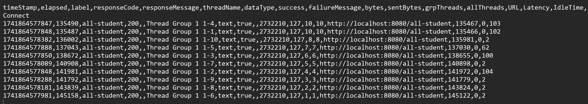

- /all-student-name endpoint by CLI
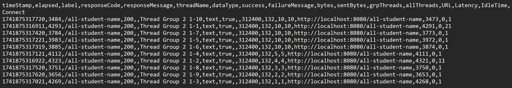

- /highest-gpa endpoint by CLI
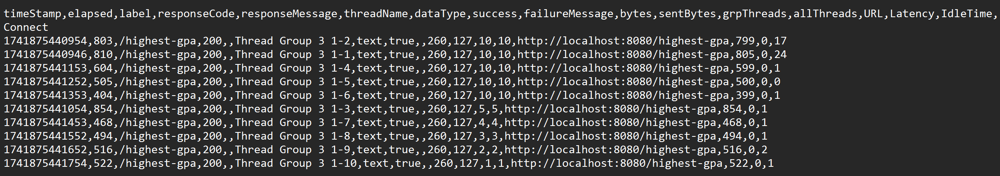

<html lang="en">

Reflection

Please answer the following questions:

1. What is the difference between the approach of performance testing with JMeter and profiling with IntelliJ Profiler in the context of optimizing application performance?
\
JMeter and IntelliJ Profiler have different purposes in analyzing program performance. 
JMeter simulates multiple users, measures response times, and identifies performance bottlenecks at the system level, like high latency and slow endpoints.
Meanwhile, IntelliJ Profiler analyzes CPU usage, memory allocation, and thread activity to pinpoint inefficiencies in code execution, such as slow methods and excessive memory usage.
In summary, JMeter is for external performance testing, while IntelliJ Profiler is for internal application analysis.
2. How does the profiling process help you in identifying and understanding the weak points in your application?
\
In this case, the profiling process helps me by identifying which methods take the most CPU time.
IntelliJ profiling can also detect memory leak by finding excessive object allocations,
help diagnose deadlocks and inefficient thread usage, and reveals slow or excessive queries via Hibernate or JDBC profiling.
3. Do you think IntelliJ Profiler is effective in assisting you to analyze and identify bottlenecks in your application code?
\   
IntelliJ Profiler is very effective for analyzing code-level performance issues. It provides:
- Real-time performance metrics (CPU, memory, threads).
- Flame graphs and call trees to visualize execution bottlenecks.
- Memory allocation tracking to find unnecessary object creation.

However, for external load testing, it's better to use JMeter.
4. What are the main challenges you face when conducting performance testing and profiling, and how do you overcome these challenges?
\
The main challenges may be the amount of time and resources needed to conduct these tests caused by
the ineffectiveness of the initial code. 
5. What are the main benefits you gain from using IntelliJ Profiler for profiling your application code?
\
The main benefits of using IntelliJ Profiler:
- Specifies which method is most inefficient from CPU time taken and memory usage,
- Real-time monitoring from IntelliJ, inefficient code segment is directly highlighted, and most importantly
- No extra setup or external tools are required for profiling Java applications.
6. How do you handle situations where the results from profiling with IntelliJ Profiler are not entirely consistent with findings from performance testing using JMeter?
\   
If profiling results (code-level) do not match JMeter’s performance testing (system-level):
- Check if the bottleneck is external (e.g., database queries, network latency).
- Profiling in an isolated local environment might not reflect production load, analysis under more realistic conditions may be needed.
- High response times in JMeter but low CPU usage in IntelliJ may be caused by external factors such as I/O delays, slow DB queries, or thread blocking issues.
7. What strategies do you implement in optimizing application code after analyzing results from performance testing and profiling? How do you ensure the changes you make do not affect the application's functionality?
\
In optimizing tests, I refactor inefficient methods by optimizing loops and reducing redundant calculations,
improve database performance with index optimization, and optimize memory usage by reducing object allocations. 
Then, I ensure the changes doesn't affect the original functionality with performance tests.

</html>

### Optimization:
- /all-student endpoint before optimization
  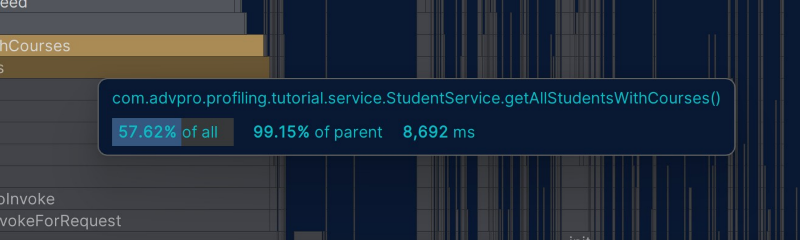

- /all-student endpoint after optimization
  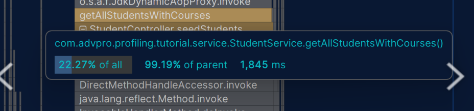

- /all-student-name endpoint before optimization
  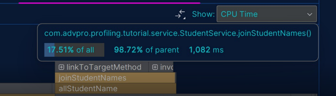

- /all-student-name endpoint after optimization
  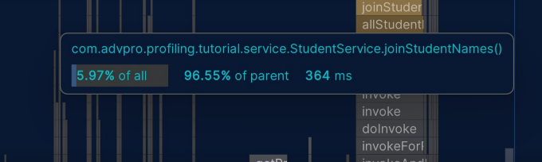

- /highest-gpa endpoint before optimization
  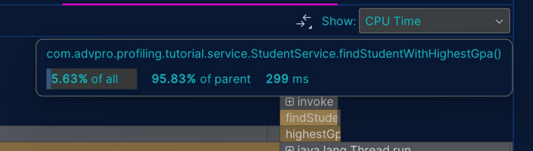

- /highest-gpa endpoint after optimization
  

- /all-student endpoint after optimization, Jmeter
  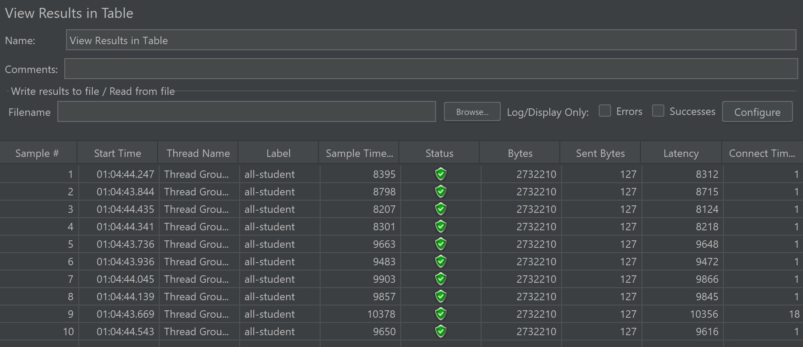

- /all-student-name endpoint after optimization, Jmeter
  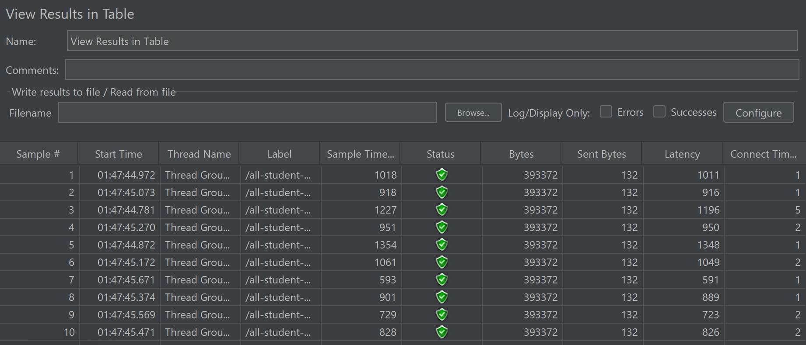

- /highest-gpa endpoint after optimization, Jmeter
  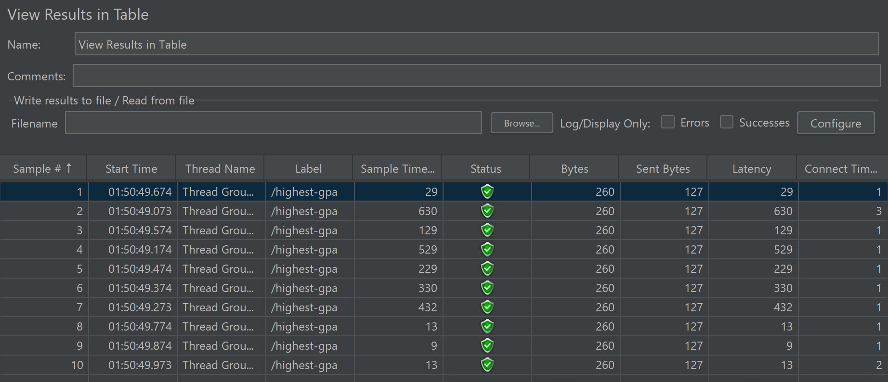
